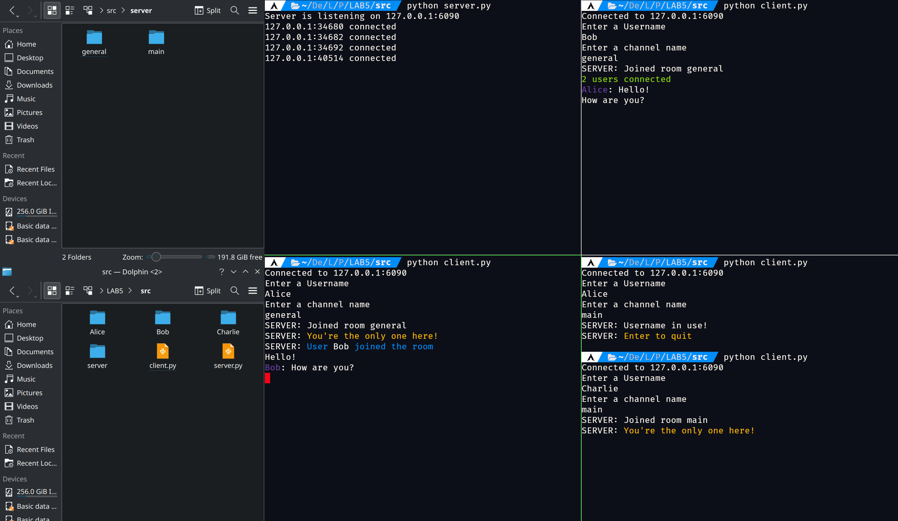
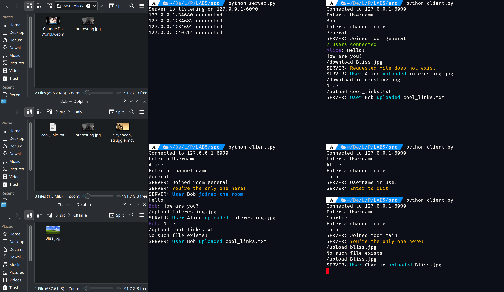
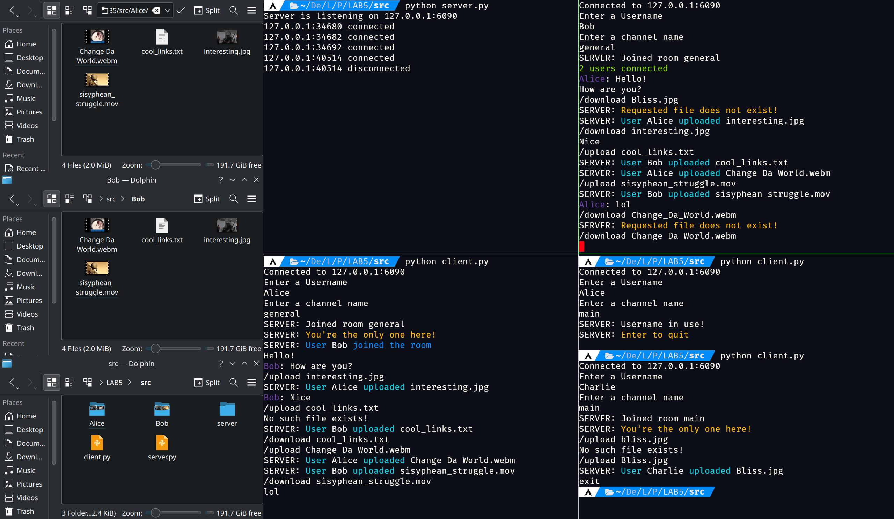
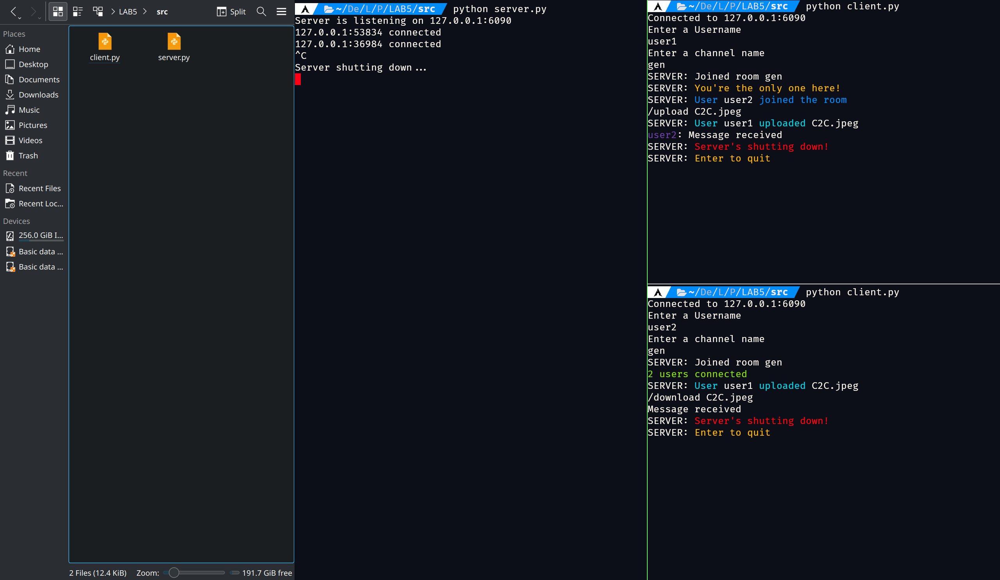

## Basic TCP Chat

### Homework:

When a user is created and connected, a folder with their name is automatically created from which they can upload media to the server. The server itself generates its own folders depending on what rooms are open and stores media uploaded by the users in the respective folders.

The server is capable of sending and receiving files from users, making files available for download for all the users of a channel. Users can upload files to the server via `/upload <filename>` and retrieve files via `/download <filename>`. If a user tries to upload or download a non-existent file, they will be warned. Users cannot download files sent in a room they're not in.

Since all files are uploaded as a Base64 encoded bytestring without modifications, ANY file can be sent, regardless of format. Communication is still done using `json`.

Upon disconnection, the user's folder is erased, along with its contents. The server's media folder is erased when shutting down and rooms with no users in them have their media folders deleted. This is done to prevent accumulation of unneeded files and to not allow users to save files that were sent by others in the past in a room that happens to have the same name. The following screenshots demonstrate that:

Notice how Charlie's folder is gone once he is disconnected:

The server folder is deleted and users are disconnected, erasing the data too. Users are notified when the server is shutting down.

